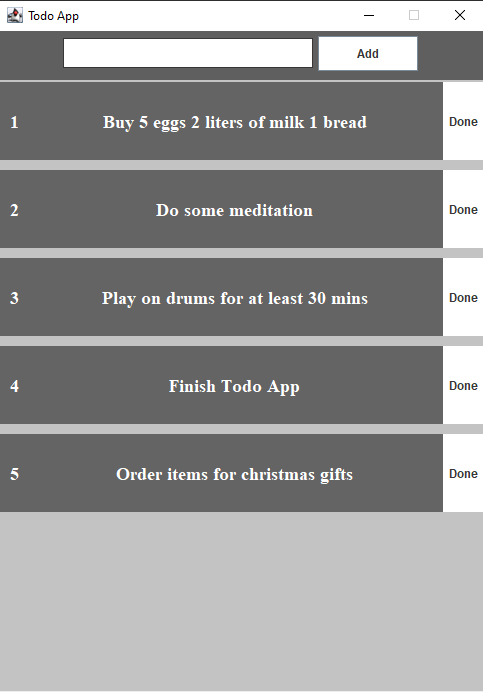

# TodoApp

This is simple to do list app based on Java GUI Swing.
Write down your task and click add to save it.
When you are done simply click "Done" and task will be deleted.
Nothing too complicated.

